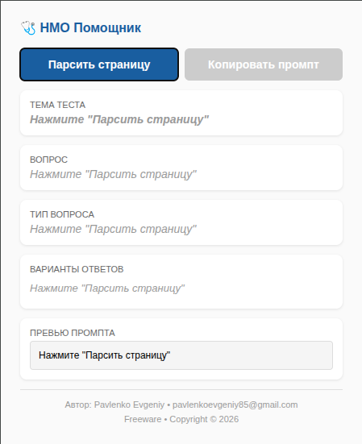

# 📚 НМО Помощник

> Chrome-расширение (Manifest V3) для парсинга тестовых вопросов с портала НМО и генерации промпта для ИИ-помощника.

## 🖼 Превью


## ✨ Что делает

1. 🔍 **Парсит страницу теста** — извлекает тему, текст вопроса, тип вопроса (один ответ / несколько ответов) и варианты ответов
2. 👁 **Показывает данные в popup** — все извлечённые данные отображаются прямо во всплывающем окне
3. 🤖 **Генерирует промпт** — собирает из данных готовый текст, который можно скопировать в буфер обмена и отправить ИИ

## ⚙️ Установка

1. Склонировать репозиторий
2. Открыть Chrome → `chrome://extensions/`
3. Включить **Режим разработчика** (переключатель в правом верхнем углу)
4. Нажать **Загрузить распакованное расширение**
5. Указать папку проекта

## 🚀 Использование

1. Открыть страницу с тестом НМО (например, `https://edu.rosminzdrav.ru/`)
2. Кликнуть на иконку расширения в панели Chrome
3. Нажать кнопку **Парсить страницу**
4. Просмотреть извлечённые данные (тема, вопрос, тип, варианты ответов)
5. Нажать **Копировать промпт** — текст промпта попадает в буфер обмена
6. Вставить промпт в чат с DeepSeek (ChatGPT, Claude, Grok и т.д.)
7. (*СОВЕТ*) Прикрепите в чат DeepSeek через значок "скрепка" файл с клинреками - так вероятность правильного ответа очень сильно повысится.

## 📁 Структура файлов

```
.
├── manifest.json    — конфигурация расширения (Manifest V3)
├── popup.html       — UI всплывающего окна
├── popup.js         — логика popup: парсинг через content script, копирование
├── content.js       — content script: извлекает данные со страницы НМО
├── icon.png         — иконка расширения
└── README.md        — этот файл
```

## 🏗 Архитектура

- **popup.js** запрашивает у **content.js** данные через `chrome.runtime.sendMessage`
- **content.js** ищет на странице элементы с CSS-классами:
  - `.mat-card-title-quiz-custom` — тема теста
  - `div.question-title-text` — текст вопроса
  - `div.mat-card-question__type` — тип вопроса
  - `span.question-inner-html-text` — варианты ответов
- Сгенерированный промпт копируется в буфер обмена через `navigator.clipboard`

## 📋 Требования

- Chrome 88+ (поддержка Manifest V3)
- Права: `activeTab`, `clipboardWrite`, `scripting`

---

**Автор:** Pavlenko Evgeniy  
**Email:** pavlenkoevgeniy85@gmail.com  
**Лицензия:** Freeware  
**Copyright:** 2026
